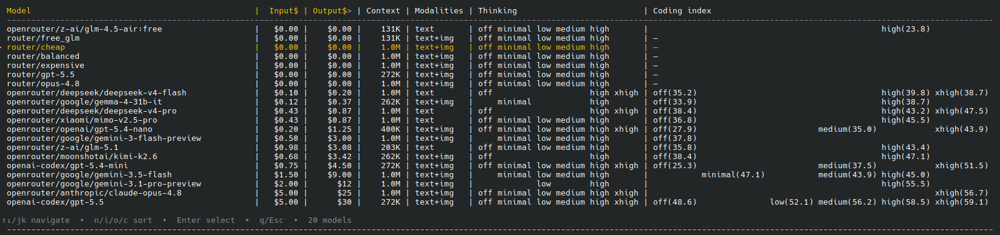

# pi-scoped-models-extra-info

> Interactive table of your pi coding agent's scoped models — pricing, context window, thinking levels, modalities, and optional coding benchmarks.



## Features

- **Rich model table** — shows all your enabled (scoped) models in one view
- **Columns**: model slug, input price, output price, context window, input modalities, thinking levels, and coding benchmarks
- **Sortable** — press `n` (name), `i` (input price), `o` (output price), `c` (coding index)
- **Model switching** — press Enter on any row to switch to that model
- **Keyboard navigation** — `↑↓/jk` to move, `Home`/`End` to jump, `q/Esc` to close
- **Optional coding benchmarks** — per-thinking-level coding index from [Artificial Analysis](https://artificialanalysis.ai) (if `AA_API_KEY` is set)

## Installation

### Via git (pi package manager)

```bash
pi install git:github.com/kdejaeger/pi-scoped-models-extra-info
```

Then reload pi (`/reload`) or restart.

### Via local clone

Clone the repo and add to `~/.pi/agent/settings.json`:

```json
{
  "extensions": [
    "~/pi-scoped-models-extra-info/index.ts"
  ]
}
```

## Usage

Run the command:

```
/scoped-models-extra-info
```

Or use the keyboard shortcut: **`Alt+E`**

### Navigation

| Key | Action |
|-----|--------|
| `↑` / `k` | Move selection up |
| `↓` / `j` | Move selection down |
| `Home` / `Ctrl+A` | Jump to first model |
| `End` / `Ctrl+E` | Jump to last model |
| `Enter` / `Space` | Switch to selected model |
| `n` | Sort by model name |
| `i` | Sort by input price |
| `o` | Sort by output price |
| `c` | Sort by coding index |
| `q` / `Esc` | Close table |

## Configuration

### Coding benchmarks (optional)

The extension can show Artificial Analysis coding index scores per thinking level. To enable this:

1. Get an API key from [artificialanalysis.ai](https://artificialanalysis.ai)
2. Set the environment variable before starting pi:

```bash
export AA_API_KEY="aa_your_key_here"
pi
```

Or add to your `~/.bashrc` / `~/.zshrc`:

```bash
export AA_API_KEY="aa_your_key_here"
```

Without this variable, the extension works perfectly — it just omits the coding index column.

### What it shows

The table displays only the models you have **enabled/scoped** in your pi `settings.json` (`enabledModels`). If you haven't scoped any models, it shows all available models.

**Pricing** comes from pi's built-in model registry — it's accurate for all providers pi supports (OpenAI, Anthropic, Google, OpenRouter, Groq, etc.).

**Thinking levels** are resolved from each model's capabilities, with smart fallback for OpenRouter-proxied models.

## Package structure

```
pi-scoped-models-extra-info/
├── index.ts              # Extension source
├── package.json          # Pi package manifest
├── screenshot.png        # Table screenshot
└── README.md             # This file
```

